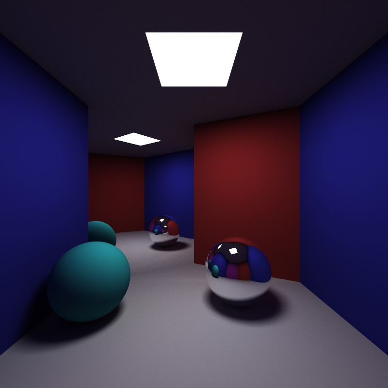

# Raytracer

This is a raytracer done from scratch by [Andreas Ekberg](https://github.com/andreas-ekberg) and [Gustav Johansson](https://github.com/vibevalley), made in C++. The raytracer includes global illumination and 2 different surfaces, Lambertian and Mirror with perfect reflection.

## How to run

Clone the repository and CMake the project and open it in Visual Studio. Thereafter you can run the raytracer, preferably in release mode for faster computation. The following parameters can be worth changing to you desire.

Both parameters is in main.cpp

```cpp
...
Camera camera = Camera(glm::dvec3(0, -1, 1), glm::dvec3(0, 1, 1), glm::dvec3(0, -1, -1), glm::dvec3(0, 1, -1), glm::dvec3(-1, 0, 0), pixelSizeX, pixelSizeY, imageWidth, imageHeight);

int n = 128*8; // Number of samples per pixel
int rowsDone = 0;

concurrency::parallel_for(size_t(0), (size_t)imageHeight, [&](size_t j)
...

```

Above, the variable n represents how many samples the anti-aliasing will perform, which means how many rays will be shot out in one pixel.

```cpp
...
int main()
{
    HelperFunctions theHelperFunctions = HelperFunctions();
    // Image size
    int imageWidth = 800;
    int imageHeight = 800;

    ofstream image_file("image.ppm");
    ...

```

Above you can adjust the pixel width and height which will greatly affect the computation time.

## Results



Above is a rendered image with alot of sampling resulting in a nice looking even image (n = 1024). Below is the same image but with 32 samples resulting in a more noisy image. 


